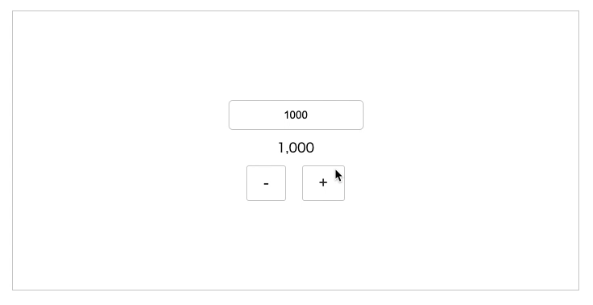

# TSX to DOM

JSX を DOM に変換する`h()`関数。軽量な実装（20 行程度）で微調整も簡単。以下のようなケースでの利用を想定。

- React や Vue を使うのは大げさ
- ライブラリのバージョンアップ追随を避けたい
- 既存サイトへのウィジェット的な実装のため干渉リスクに配慮したい

```jsx
const dom = (
  <div>
    <span>hello</span>
  </div>
);
document.body.append(dom);
```

コンポーネントも使える。

```jsx
const Greeting = (props: { name: string }) => <span>Hello {props.name}</span>;

const dom = (
  <div>
    <Greeting name={'taro'} />
  </div>
);
document.body.append(dom);
```

スコープ化した CSS やイベントハンドラも使える。

```jsx
import { h } from '../../../src/h';
import styles from './CountEdit.module.css';

export const CountEdit = ({
  id,
  count,
  onEdit,
}: {
  id: string,
  count: number,
  onEdit: (event: any) => void,
}) => {
  return <input id={id} value={count} onInput={onEdit} class={styles.inp} />;
};
```

リアクティブの無い React 的な実装が可能（再描画時のカーソル位置の維持もちょっとした工夫で可能）

- https://github.com/cyokodog/tsx-to-dom/tree/main/example


